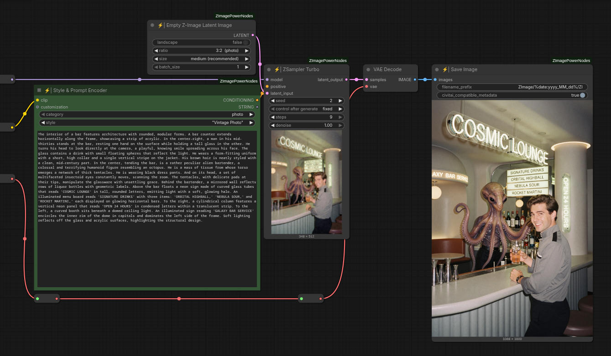
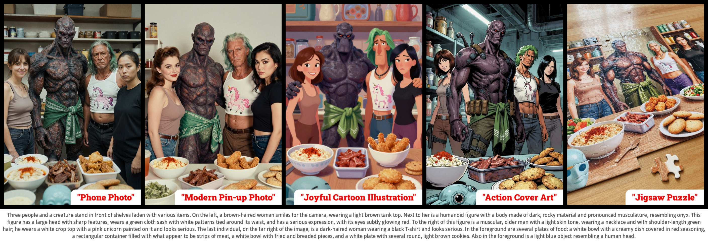
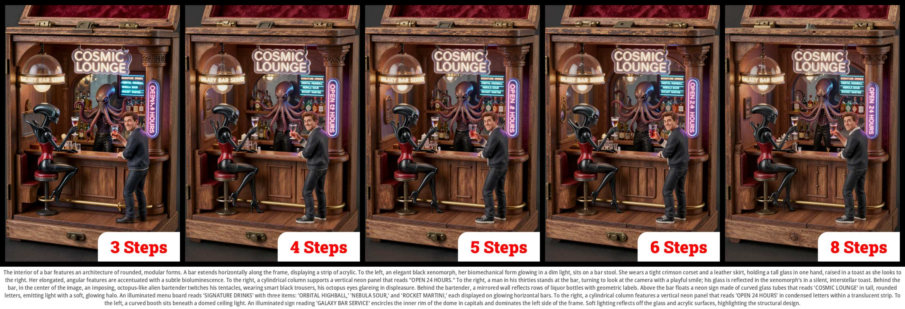
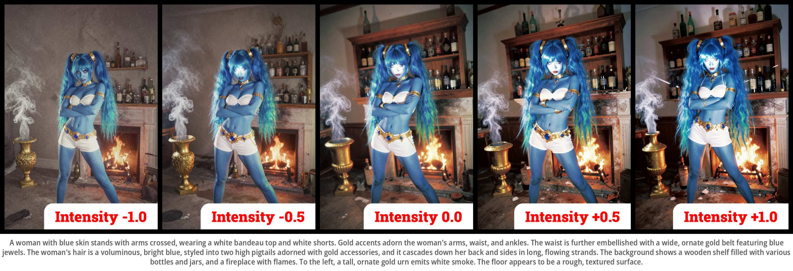
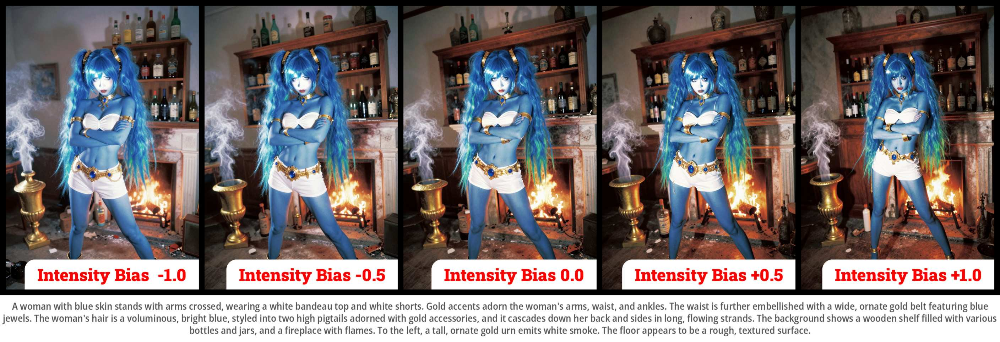
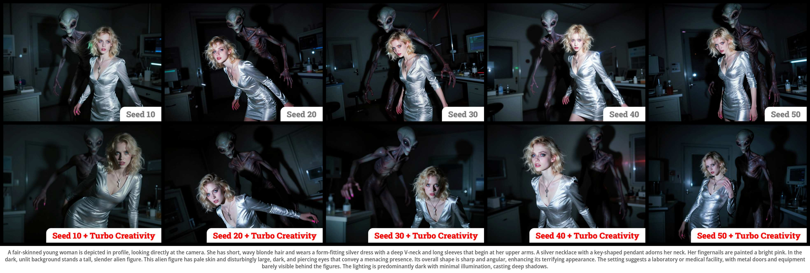
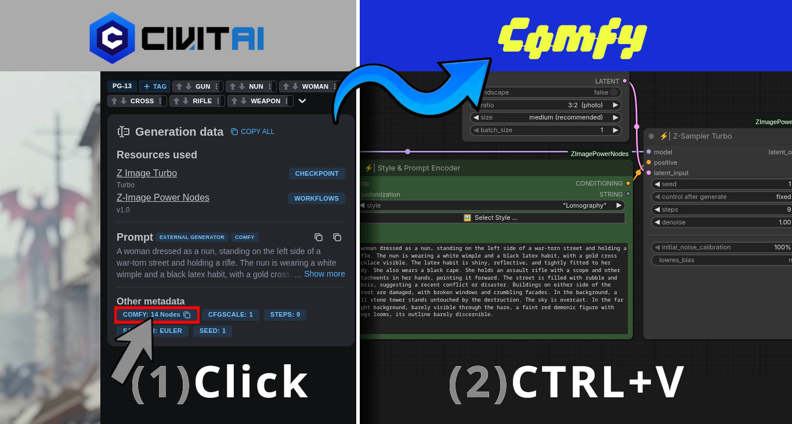

<div align="center">

# Z-Image Power Nodes <br><sub><sup><i>Pushing the best image generation model to its limits!</i></sup></sub>
[](https://civitai.com/models/2322533/z-image-power-nodes)  
[](#)
[](#)
[](#)
[](#)  
</img>

</div>

**Z-Image Power Nodes** is a collection of nodes designed specifically for the [Z-Image / Z-Image Turbo model](https://github.com/Tongyi-MAI/Z-Image). They are based on some ideas and discoveries I made while developing the [Amazing Z-Image Workflow](https://github.com/martin-rizzo/AmazingZImageWorkflow).

❤️ If you find these nodes useful or they’ve helped you in your projects, please consider supporting my work.
Your support allows me to continue researching and creating new developments within the open source community.  
There are several ways to do so:
  - **Give the repository a star:** if we reach 500 stars, big things could happen!
  - **Ko-fi:** [https://ko-fi.com/martinrizzo](https://ko-fi.com/martinrizzo)

*Every contribution, no matter how small, is greatly appreciated! Thank you.*


## Table of Contents
1. [Features](#features)
2. [Documentation](#power-nodes-documentation)
3. [Examples](#examples)
4. [Installation](#installation)
5. [Recommended Checkpoints](#recommended-checkpoints)
6. [License](#license)

## Features

### Visual Styles

The "Style & Prompt Encoder" node comes with a library of over 100 predefined styles. Just pick one, and the node automatically handles the prompting to shift your image's artistic direction. You can browse them all via a searchable gallery with thumbnails for quick previews. It's the perfect way to nail a consistent look without wrestling with complex prompts, all while keeping your original subject and composition intact.

</img>

### Consistency with Low Steps

The "Z-Sampler Turbo" node maintains image consistency from 3 steps onwards. Since there are minimal variations in composition, you can quickly test prompt changes with just a few steps and then crank them up later for a high-quality version. Along those lines, the sampler produces a more than acceptable result with only 5 steps, and once you hit 7 or more, the quality is high enough that you won't even need any further post-processing.

</img>

### Intensity Control

__Intensity__ is a parameter within the "Z-Sampler Turbo" node that tweaks the amplitude of the initial noise to give your images more contrast and saturation. Values above 0.0 (positives) boost contrast and sharpen edges, resulting in a more defined and vibrant look. On the flip side, values below 0.0 (negatives) yield a softer, more "washed-out" look with less micro-detail.

Just keep in mind that the final result depends a lot on your prompt and the specific style you're using. It's not a hard rule, but lower values usually complement photographic styles better, while higher values tend to work well for illustrations.

</img>

__Intensity Bias__ is a companion parameter that lets you calibrate the bias of the initial noise. You'll usually want to keep this at 0.0. You could think of it as adjusting the "brightness". Since its effect depends heavily on the prompt and image style, it doesn't always act as a simple brightness control. In some cases, it can even affect how in-focus the image looks. Just tweak it within the positive or negative range until it looks right to you.

</img>

### Turbo Creativity

__Turbo Creativity__ is an option in the "Z-Sampler Turbo" node that uses latent scrambling to increase variety without messing up the visual style or prompt. This feature attempts to improve the limited image variability seen across different seeds in Z-Image Turbo.

Currently, it only affects composition (like posing, framing, and object placement) while keeping colors and style consistent. Because this process can lead to hallucinations, I've added "refined" options that throw in some extra sampling steps to keep the image coherent. Note that using these refined options will increase the total generation time.

</img>

### Other Extras

I've also included some smaller utility nodes to make things easier. There's a VAE encoder for inpainting with Z-Image-specific parameters, a node with one-click activation for your 10 most-used styles, a node to save images with CivitAI-compatible metadata, and a few other bits and pieces.


## Power Nodes Documentation

* __[⚡Z-Sampler Turbo ^G2](https://martin-rizzo.github.io/ComfyUI-ZImagePowerNodes/#/zsampler_turbo_2)__  
<sub>A specialized sampler designed for high-quality image generation, allowing you more control over the final result.</sub>
* __[⚡Style Prompt Encoder](https://martin-rizzo.github.io/ComfyUI-ZImagePowerNodes/#/style_prompt_encoder)__  
<sub>Applies a selected visual styles to your prompt and encodes both of them using a text-encoder model (clip).
* __[⚡Style String Injector](https://martin-rizzo.github.io/ComfyUI-ZImagePowerNodes/#/style_string_injector)__  
<sub>Seamlessly integrates a chosen style into your prompt text. It accepts a string as input and modifies it based on the selected style.</sub>
* __[⚡My Top-10 Styles](https://martin-rizzo.github.io/ComfyUI-ZImagePowerNodes/#/my_top_10_styles)__  
<sub>Allows you to create a list of favorite styles for quick selection of your most used ones.</sub>
* __[⚡VAE Encode (for Soft Inpainting)](https://martin-rizzo.github.io/ComfyUI-ZImagePowerNodes/#/vae_encode_for_soft_inpainting)__  
<sub>Encodes images into a latent representation, embedding the mask that indicates where inpainting will be applied.</sub>
* __[⚡Save Image](https://martin-rizzo.github.io/ComfyUI-ZImagePowerNodes/#/save_image)__  
<sub>Saves generated images with the option to embed CivitAI-compatible metadata, making it easy to share generation parameters through that platform.</sub>
* __[⚡Empty Z-Image Latent Image](https://martin-rizzo.github.io/ComfyUI-ZImagePowerNodes/#/empty_zimage_latent_image)__  
<sub>Creates an empty latent image of the appropriate size for Z-Image, selecting aspect ratio, scale, and orientation.</sub>


## Examples

[__/workflows__](/workflows)  
This folder contains reference workflows demonstrating the use of the Power Nodes across various tasks.
These are simple yet powerful examples that serve as an excellent resource for understanding how to utilize
each node.

[__Z-Image Power Nodes on CivitAI__](https://civitai.com/models/2322533)  
This page contains hundreds of images created using the Z-Image model and the Power Nodes.
Images posted by me always include the prompt and complete workflow (*), which you can use as a
starting point for your own generation. Many users share their amazing creations in this community.

</img>  
<sub>(*) On CivitAI, each image includes a sidebar panel with metadata. To easily extract the workflow,  
click the "COMFY 14 Nodes" button in the Other Metadata section and paste it (CTRL+V) directly into ComfyUI.</sub>

<!--
[__/styles/samples_wf__](/styles/samples_wf)  
This folder includes all the workflows used to generate the thumbnail images in the styles gallery.
-->

## Installation
_Ensure you have the latest version of [ComfyUi](https://github.com/comfyanonymous/ComfyUI)._

### Installation via ComfyUI Manager (Recommended)

The easiest way to install the nodes is through [ComfyUI-Manager](https://github.com/Comfy-Org/ComfyUI-Manager):

  1. Open ComfyUI and click on the "Manager" button to launch the "ComfyUI Manager Menu".
  2. Within the ComfyUI Manager, locate and click on the "Custom Nodes Manager" button.
  3. In the search bar, type "Z-Image Power Nodes".
  4. Select the option from the search results and click the "Install" button.
  5. Restart ComfyUI to ensure the changes take effect.

### Manual Installation

<details>
<summary>🛠️ Manual installation instructions. (expand for details)</summary>
.

1. Open your preferred terminal application.
2. Navigate to your ComfyUI directory:
   ```bash
   cd <your_comfyui_directory>
   ```
3. Move into the **custom_nodes** folder and clone the repository:
   ```bash
   cd custom_nodes
   git clone https://github.com/martin-rizzo/ComfyUI-ZImagePowerNodes.git
   ```
</details>

### Windows Portable Installation

<details>
<summary>🛠️ Windows portable installation instructions. (expand for details)</summary>
.

1. Go to where you unpacked **ComfyUI_windows_portable**,  
   you'll find your `run_nvidia_gpu.bat` file here, confirming the correct location.
3. Press **CTRL + SHIFT + RightClick** in an empty space and select "Open PowerShell window here".
4. Clone the repository into your custom nodes folder using:
   ```
   git clone https://github.com/martin-rizzo/ComfyUI-ZImagePowerNodes .\ComfyUI\custom_nodes\ComfyUI-ZImagePowerNodes
   ```
</details>


## Recommended Checkpoints

The workflows in the [/workflows directory](/workflows) are preconfigured for these checkpoints. The BF16 version is the heaviest and is the one used by ComfyUI in their example workflows. Between FP8 and GGUF, I can tell you that FP8 is a bit faster and ComfyUI has native support for safetensors, but generally, I think GGUF has the best quality for its size, even if it's slower. If it weren't for the speed and native support, I'd recommend GGUF without a second thought.

Note: if you're going to use FP8 checkpoints other than the ones recommended here, test them carefully because most of the FP8 ones I've tried give pretty bad results, mainly because they use naive truncation to FP8 which significantly reduces precision (instead of using scaling and mixing in higher-precision data types).

### GGUF (Q8/Q5)

 - __[z_image_turbo-Q5_K_S.gguf](https://huggingface.co/jayn7/Z-Image-Turbo-GGUF/blob/main/z_image_turbo-Q5_K_S.gguf)__ <sub>[5.19 GB]</sub>\
   Local Directory: __`ComfyUI/models/diffusion_models/`__
 - __[Qwen3-4B-Q8_0.gguf](https://huggingface.co/Qwen/Qwen3-4B-GGUF/blob/main/Qwen3-4B-Q8_0.gguf)__ <sub>[4.28 GB]</sub>\
   Local Directory: __`ComfyUI/models/text_encoders/`__
 - __[ae.safetensors](https://huggingface.co/Comfy-Org/z_image_turbo/blob/main/split_files/vae/ae.safetensors)__ <sub>[335 MB]</sub>\
   Local Directory: __`ComfyUI/models/vae/`__

### Safetensors (FP8)

 - __[z-image-turbo_fp8_scaled_e4m3fn_KJ.safetensors](https://huggingface.co/Kijai/Z-Image_comfy_fp8_scaled/blob/main/z-image-turbo_fp8_scaled_e4m3fn_KJ.safetensors)__ <sub>(6.16 GB)</sub>\
   Local Directory: __`ComfyUI/models/diffusion_models/`__
 - __[qwen3_4b_fp8_scaled.safetensors](https://huggingface.co/hhsebsb/qwen3-4b-fp8-scaled/blob/main/qwen3_4b_fp8_scaled.safetensors)__ <sub>(4.41 GB)</sub>\
   Local Directory: __`ComfyUI/models/text_encoders/`__
 - __[ae.safetensors](https://huggingface.co/Comfy-Org/z_image_turbo/blob/main/split_files/vae/ae.safetensors)__ <sub>(335 MB)</sub>\
   Local Directory: __`ComfyUI/models/vae/`__

### Safetensors (BF16)

 - __[z_image_turbo_bf16.safetensors](https://huggingface.co/Comfy-Org/z_image_turbo/blob/main/split_files/diffusion_models/z_image_turbo_bf16.safetensors)__ <sub>(12.3 GB)</sub>\
   Local Directory: __`ComfyUI/models/diffusion_models/`__
 - __[qwen_3_4b.safetensors](https://huggingface.co/Comfy-Org/z_image_turbo/blob/main/split_files/text_encoders/qwen_3_4b.safetensors)__ <sub>(8.04 GB)</sub>\
   Local Directory: __`ComfyUI/models/text_encoders/`__
 - __[ae.safetensors](https://huggingface.co/Comfy-Org/z_image_turbo/blob/main/split_files/vae/ae.safetensors)__ <sub>(335 MB)</sub>\
   Local Directory: __`ComfyUI/models/vae/`__


## License

Copyright (c) 2026 Martin Rizzo  
This project is licensed under the MIT license.  
See the ["LICENSE"](LICENSE) file for details.
  
