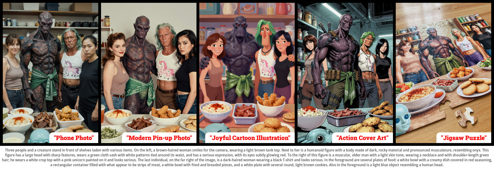
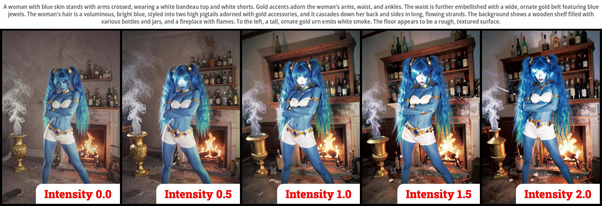
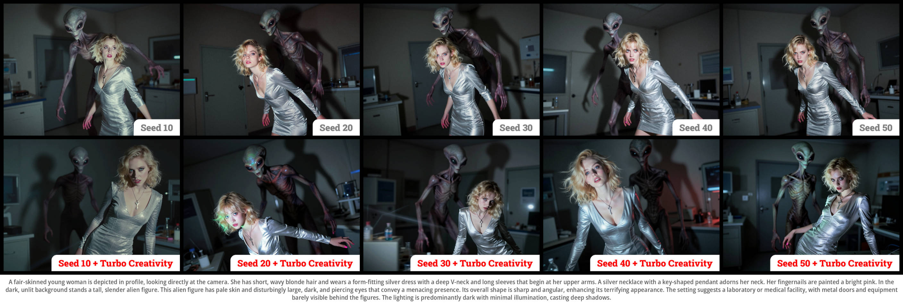

<div align="center">

# Z-Image Power Nodes <br><sub><sup><i>Pushing the best image generation model to its limits!</i></sup></sub>
[](https://civitai.com/models/2322533/z-image-power-nodes)  
[](#)
[](#)
[](#)
[](#)  
</img>

</div>

**Z-Image Power Nodes** is a collection of nodes designed specifically for the [Z-Image / Z-Image Turbo model](https://github.com/Tongyi-MAI/Z-Image). They are based on some ideas and discoveries I made while developing the [Amazing Z-Image Workflow](https://github.com/martin-rizzo/AmazingZImageWorkflow).

❤️ If you find these nodes useful or they’ve helped you in your projects, please consider supporting my work.
Your support allows me to continue researching and creating new developments within the open source community.  
There are several ways to do so:
  - **Give the repository a star:** if we reach 500 stars, big things could happen!
  - **Ko-fi:** [https://ko-fi.com/martinrizzo](https://ko-fi.com/martinrizzo)

*Every contribution, no matter how small, is greatly appreciated! Thank you.*


## Table of Contents
1. [Nodes](#nodes)
2. [Examples](#examples)
3. [Installation](#installation)
4. [Recommended Checkpoints](#recommended-checkpoints)
5. [License](#license)

## Features

### Visual Styles

</img>

### Intensity Control

__"Intensity"__ is a parameter within the Z-Sampler Turbo node that modifies the amplitude of the initial noise to generate images with enhanced contrast and saturation. Values above 1.0 heighten contrast and edge sharpness, resulting in a more defined and vibrant aesthetic. Conversely, values below 1.0 yield a softer, more muted look with reduced micro-detail.

It is important to note that the final effect of this parameter is heavily influenced by the prompt and the specific image style being used. While not a hard rule, lower values generally complement photographic styles, whereas higher values tend to work better for illustrations.

</img>

### Turbo Creativity

__"Turbo Creativity"__ is a toggle in the Z-Sampler Turbo node that enables latent shuffling during the sampling process to increase variety without compromising the overall visual style or prompt instructions. This feature attempts to address the inherent limitations of Z-Image Turbo regarding image variability across different seeds.

Currently, Turbo Creativity exclusively influences compositional elements (such as object placement, posing, and framing) while maintaining consistency in color palettes and image style. Because of how it is implemented, this process may introduce hallucinations; these can be mitigated by increasing the "Consistency Extra Steps" parameter to further refine the process.

</img>

### Consistency Extra Steps

???

## Nodes

* __[⚡Z-Sampler Turbo](docs/zsampler_turbo.md)__  
<sub>A specialized sampler designed to Z-Image Turbo that achieves sufficient quality to eliminate the need for further post-processing.</sub>
* __[⚡Style Prompt Encoder](docs/style_prompt_encoder.md)__  
<sub>Applies a selected visual styles to your prompt and encodes both of them using a text-encoder model (clip).
* __[⚡Style String Injector](docs/style_string_injector.md)__  
<sub>Seamlessly integrates a chosen style into your prompt text. It accepts a string as input and modifies it based on the selected style.</sub>
* __[⚡My Top-10 Styles](docs/my_top_10_styles.md)__  
<sub>Allows you to create a list of favorite styles for quick selection of your most used ones.</sub>
* __[⚡VAE Encode (for Soft Inpainting)](docs/vae_encode_for_soft_inpainting.md)__  
<sub>Encodes images into a latent representation, embedding the mask that indicates where inpainting will be applied.</sub>
* __[⚡Save Image](docs/save_image.md)__  
<sub>Saves generated images with the option to embed CivitAI-compatible metadata, making it easy to share generation parameters through that platform.</sub>
* __[⚡Empty Z-Image Latent Image](docs/empty_zimage_latent_image.md)__  
<sub>Creates an empty latent image of the appropriate size for Z-Image, selecting aspect ratio, scale, and orientation.</sub>


## Examples

[__/workflows__](/workflows)  
This folder contains reference workflows demonstrating the use of the Power Nodes across various tasks.
These are simple yet powerful examples that serve as an excellent resource for understanding how to utilize
each node.

[__/styles/samples_wf__](/styles/samples_wf)  
This folder includes all the workflows used to generate the thumbnail images in the styles gallery.

[__Z-Image Power Nodes on CivitAI__](https://civitai.com/models/2322533)  
This page contains hundreds of images created using the Z-Image model and the Power Nodes.
Images posted by me always include the prompt and complete workflow (*), which you can use as a
starting point for your own generation. Many users share their amazing creations in this community.

</img>  
<sub>(*) On CivitAI, each image includes a sidebar panel with metadata. To easily extract the workflow,  
click the "COMFY: N Nodes" button in the Other Metadata section and paste it (CTRL+V) directly into ComfyUI.</sub>


## Installation
_Ensure you have the latest version of [ComfyUi](https://github.com/comfyanonymous/ComfyUI)._

### Installation via ComfyUI Manager (Recommended)

The easiest way to install the nodes is through [ComfyUI-Manager](https://github.com/Comfy-Org/ComfyUI-Manager):

  1. Open ComfyUI and click on the "Manager" button to launch the "ComfyUI Manager Menu".
  2. Within the ComfyUI Manager, locate and click on the "Custom Nodes Manager" button.
  3. In the search bar, type "Z-Image Power Nodes".
  4. Select the option from the search results and click the "Install" button.
  5. Restart ComfyUI to ensure the changes take effect.

### Manual Installation

<details>
<summary>🛠️ Manual installation instructions. (expand for details)</summary>
.

1. Open your preferred terminal application.
2. Navigate to your ComfyUI directory:
   ```bash
   cd <your_comfyui_directory>
   ```
3. Move into the **custom_nodes** folder and clone the repository:
   ```bash
   cd custom_nodes
   git clone https://github.com/martin-rizzo/ComfyUI-ZImagePowerNodes.git
   ```
</details>

### Windows Portable Installation

<details>
<summary>🛠️ Windows portable installation instructions. (expand for details)</summary>
.

1. Go to where you unpacked **ComfyUI_windows_portable**,  
   you'll find your `run_nvidia_gpu.bat` file here, confirming the correct location.
3. Press **CTRL + SHIFT + RightClick** in an empty space and select "Open PowerShell window here".
4. Clone the repository into your custom nodes folder using:
   ```
   git clone https://github.com/martin-rizzo/ComfyUI-ZImagePowerNodes .\ComfyUI\custom_nodes\ComfyUI-ZImagePowerNodes
   ```
</details>


## Recommended Checkpoints

### GGUF Format

<sub>GGUF checkpoints tend to run slightly slower in ComfyUI. However, if you are building a complex workflow that involves other models or using heavy LLMs with ollama, GGUF files can help prevent system freezes and OOM errors during generation, especially when VRAM is limited. For simple image generation workflows, a safetensors file (though heavier) might be preferable. When working with GGUF in Z-Image, from my experience, using the Q5_K_S quantization typically offers the best balance between file size and prompt response. </sub>

Note: ComfyUI does not natively support GGUF format, so you need to install the [ComfyUI-GGUF](https://github.com/city96/ComfyUI-GGUF) nodes.

 - __[z_image_turbo-Q5_K_S.gguf](https://huggingface.co/jayn7/Z-Image-Turbo-GGUF/blob/main/z_image_turbo-Q5_K_S.gguf)__ <sub>[5.19 GB]</sub>\
   Local Directory: __`ComfyUI/models/diffusion_models/`__
 - __[Qwen3-4B.i1-Q5_K_S.gguf](https://huggingface.co/mradermacher/Qwen3-4B-i1-GGUF/blob/main/Qwen3-4B.i1-Q5_K_S.gguf)__ <sub>[2.82 GB]</sub>\
   Local Directory: __`ComfyUI/models/text_encoders/`__
 - __[ae.safetensors](https://huggingface.co/Comfy-Org/z_image_turbo/blob/main/split_files/vae/ae.safetensors)__ <sub>[335 MB]</sub>\
   Local Directory: __`ComfyUI/models/vae/`__

### Safetensors Format

<sub>Safetensors files are generally larger, but ComfyUI includes several built-in optimizations to speed up generation even with limited VRAM. It's always a good idea to test the original safetensors checkpoints on your system to see how they perform. However, using safetensors in fp8 format is strongly discouraged as it can significantly reduce quality. If you have an RTX 50 series GPU based on Blackwell architecture, NVFP4 quantized safetensors could be a better choice.</sub>

 - __[z_image_turbo_bf16.safetensors](https://huggingface.co/Comfy-Org/z_image_turbo/blob/main/split_files/diffusion_models/z_image_turbo_bf16.safetensors)__ <sub>(12.3 GB)</sub>\
   Local Directory: __`ComfyUI/models/diffusion_models/`__
 - __[qwen_3_4b.safetensors](https://huggingface.co/Comfy-Org/z_image_turbo/blob/main/split_files/text_encoders/qwen_3_4b.safetensors)__ <sub>(8.04 GB)</sub>\
   Local Directory: __`ComfyUI/models/text_encoders/`__
 - __[ae.safetensors](https://huggingface.co/Comfy-Org/z_image_turbo/blob/main/split_files/vae/ae.safetensors)__ <sub>(335 MB)</sub>\
   Local Directory: __`ComfyUI/models/vae/`__


## License

Copyright (c) 2026 Martin Rizzo  
This project is licensed under the MIT license.  
See the ["LICENSE"](LICENSE) file for details.
  
