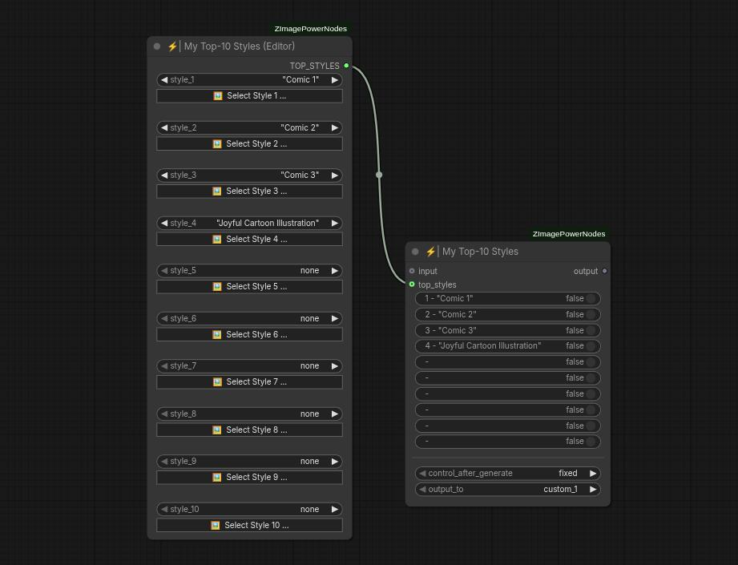

# My Top-10 Styles & Editor
</img>

The "My Top-10 Styles" and "My Top-10 Styles (Editor)" nodes work together to create a list of favorite styles, allowing for quick selection from this list. If you frequently use a couple of specific styles, these nodes enable you to set up a workflow where those styles are just one click away.

The editor node is straightforward: it lets you specify which style occupies each of the 10 available positions in the list. It must always be connected to the primary "My Top-10 Styles" node via the "top_styles" input.

## Inputs

### input
Optional input that enables concatenation with other "My Top-10 Styles" nodes, expanding the style list beyond 10 entries.

### top_styles
The list of selected 10 styles, which should always be connected to a "My Top-10 Styles (Editor)" node.

### \<style selection switches\>
Ten toggle switches labeled from 1 to 10. These allow you to easily choose which of the predefined styles is active, corresponding directly to their position in the list configured via the editor node.

### control_after_generate
Provides the option for the selected style to change after each generation. This way, you can automatically generate the same prompt with different styles.

### output_to
Specifies under which custom style slot the selected style will be found. For example, if set to "custom_1" and the current selection is "selfie", then the "Custom 1" style slot will behave exactly like "Selfie".
Typically this parameter should be set to "custom_1" across all nodes in a chain. The node responsible for encoding prompts, such as "Style & Prompt Encoder", should also have "Custom 1" selected as the active style. However, advanced configurations can use up to four different slots ("custom_1" to "custom_4").

## Outputs

### output
Main output port, usually connected to nodes like "Style & Prompt Encoder" or "Style String Injector".
This port also allows concatenation with other "My Top-10 Styles" nodes in a chain to increase the number of available styles.
