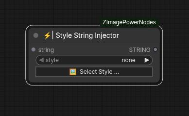

# Style String Injector

Injects a selected style into your prompt. This node takes an input string containing
the raw prompt (composition, characters, etc.) and modifies it by adding the chosen style.

## Inputs

### string
Through this connection, provide the plain text of your prompt, including composition
details or character descriptions, without specifying any particular style.

### style
Displays the currently active style, or "none" if no style will be applied.

### \<Select Style button\>
Opens the style gallery to browse and choose from available styles easily.  
This includes search functionality, filtering options, and a sample image
showing what each style would look like.

## Outputs

### string
A string with the text of your original prompt with the selected style seamlessly
integrated into it.
