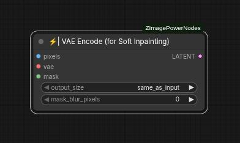

# VAE Encode (for Soft Inpainting)

This node is designed to encode images into a latent representation suitable for inpainting tasks. It includes additional preprocessing steps to adjust the input image and mask, ensuring optimal encoding by the VAE model.

## Inputs

### pixels
The input image to be encoded. 

### vae
The VAE model used to encode the image into its latent representation.

### mask
A mask indicating the regions of the input image that will be inpainted.

### output_size
Determines the size of the final image on which the inpainting process will be applied.  
Available options:
 * `safe_as_input`: Uses the same dimensions as the supplied image.
 * `large`: Scales up to an equivalent area of 1600x1600 pixels.
 * `medium`: (recommended): Scales up to an equivalent area of 1300x1300 pixels.
 * `small`: Resizes to fit within an area equivalent to 1024x1024 pixels.

### mask_blur_pixels
The number of pixels used for blurring the edges of the mask, creating a softer transition between masked and unmasked areas. Larger values result in smoother edges with increased masked regions.

## Outputs

### latent
The latent representation of the input image, with the mask embedded to indicate the inpainting regions.
This output is essential for subsequent inpainting tasks.
