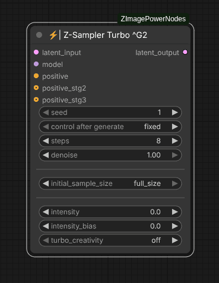

# ⚡| Z-Sampler Turbo ^G2

This second generation of Z-Sampler Turbo allows you to obtain high-quality images while giving you way more control over the sampling process, letting you get endless variations from the same prompt.

One key advantage of this sampler is its three-stage approach: composition, details, and refinement. The sigmas for each stage are calculated to keep the image stable between 3 and 20 steps. In addition to quickly generating highly detailed images, this allows you to run quick tests with just a few steps and then increase the step count when ready for a high-quality final version.

The sampler also includes "turbo_creativity," which enables it to produce more varied compositions across different seeds without altering your image's style, colors, or main prompt instructions. Although still experimental and prone to hallucinations, it has been performing quite well so far.

In addition, this sampler enhances prompt adherence, improves overall image coherence, and completely eliminates the need for a "ModelSamplingAuraFlow" node along with its 'shift' parameter adjustments.

## Inputs

### latent_input
The initial latent image to be denoised. This is typically an 'Empty Latent' for text-to-image tasks or an encoded image for image-to-image processing.

### model
Any checkpoint from the "Z-Image Turbo" model. This sampler has not been extensively tested with LoRAs applied, nor has it been determined which types of LoRA training might benefit from this three-stage sampling process. Fine-tuned checkpoints may also require parameter adjustments or workflow modifications to function correctly.

### positive
The main positive conditioning input used to guide the generation process toward the desired content, typically the prompt embeddings. There is no negative conditioning because this sampler always operates at CFG 1.0. In the future, it may be worth testing a similar 3-stage sampling approach with a slightly higher CFG value, but I wanted to avoid adding another variable to the process.

### positive_stg2
This optional input generally remains disconnected. It allows specifying a different prompt/conditioning for the second stage of the denoising process, achieving more original and creative results. The repository includes an example workflow (double_trouble) that uses this feature to merge two different visual styles.

### positive_stg3
This optional input also generally remains disconnected. It enables specifying a different prompt/conditioning for the third stage of the denoising process.

### seed
The seed used for the random noise generator, ensuring the same result is produced with the same value.

### steps
Number of iterations performed by the sampler, ranging from 3 to 20.
 - __At 3 steps__: you get a draft identical to the final image but without polished details.
 - __Starting at 5 steps__: the result is already acceptable as a final image.
 - __From 7 steps onward__: quality is high enough that no further post-processing should be necessary.
 - __Between 8 and 10 steps__: this is where the sweet spot lies, and while the sampler can handle up to 20 steps, there isn't much noticeable difference in quality beyond this range.

### denoise
The amount of denoising applied.
 - __For standard text-to-image__: keep at 1.0.
 - __For inpainting tasks__: values between 0.80 and 0.90 often work well.
 - __For i2i minor adjustments__: small values like 0.20 or 0.10 can be useful.

### initial_sample_size
The latent image size used for estimating the initial noise for intensity correction. While smaller sizes result in a faster first step, they can lead to a less accurate correction.

 - **full_size**: Uses the original image size, which generates a more correct estimation but is slower.
 - __512px__: Uses an image of 512x512 pixels, which is fast but is somewhat of a hack.
 - __256px__: Uses an image of 256x256 pixels, which is very fast but the size is far from recommended.

### intensity
Allows adjusting the amplitude of the initial noise, mainly affecting the final image's contrast and color. It's very useful for finding the point where a photograph looks most realistic or for intensifying the saturation and contrast of an illustration.

 - __Values above 0.0 (positive)__: boost contrast and sharpen edges, resulting in a more defined and vibrant look
 - __values below 0.0 (negative)__: yield a softer, more "washed-out" appearance with less micro-detail.

### intensity_bias
This is a companion parameter to intensity, letting you calibrate the bias of the initial noise. While you'll usually want to keep this at 0.0, adjusting it can fine-tune something similar to the image's brightness, though its behavior heavily depends on the prompt and style of the image. It can even affect how in-focus the image appears. Sometimes if 'intensity' is very high, setting 'intensity_bias' to a negative value may bring the image back into balance. If you decide to play with this parameter, just tweak it within the positive or negative range until it looks right to you.

### turbo_creativity
Increases model creativity by applying latent scrambling between stage 1 and stage 2. This boosts compositional variety while maintaining your image's style, colors, and main prompt instructions. Only posing, framing, and object placement are altered. Note that this can lead to hallucinations and isn't recommended for inpainting tasks.

 - __off__: no turbo creativity.
 - __scrambled__: only scrambling is applied.
 - __refined (1-step)__: scrambling plus one sampling step to restore coherence.
 - __refined (2-steps)__: scrambling with two steps to restore coherence.

## Outputs

### latent_output
The resulting denoised latent image, ready for VAE decoding or further processing in another sampler node.

