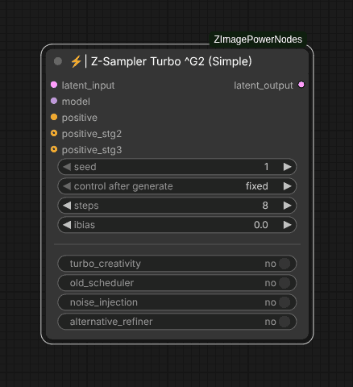

# ⚡| Z-Sampler Turbo ^G2 (Simple)

This is the simplified version of the second generation of Z-Sampler Turbo, offering a streamlined interface for quick and easy use while retaining all its features and capabilities. It is the node I most recommend within this pack's samplers as it presents parameters that have the greatest impact on the final image in an extremely user-friendly manner.

Internally, this sampler behaves exactly like other variations, using a three-stage approach: composition, details, and refinement. The sigmas for each stage are calculated to keep the image stable between 3 and 20 steps. This facilitates running quick tests with just a few steps and then increasing the step count when ready for a high-quality final version.

This node also includes "turbo_creativity", which enables it to produce more varied compositions across different seeds without altering your image's style, colors, or main prompt instructions. Although still experimental and prone to hallucinations, it has been performing quite well so far.

In addition, this node includes all the advantages of the "Z-Sampler Turbo": improved overall image coherence, better prompt adherence, and complete elimination of the need for a "ModelSamplingAuraFlow" node along with its 'shift' parameter adjustments.

## Inputs

### latent_input
The initial latent image to be denoised. This is typically an 'Empty Latent' for text-to-image tasks or an encoded image for image-to-image processing.

### model
Any checkpoint from the "Z-Image Turbo" model. This sampler has not been extensively tested with LoRAs applied, nor has it been determined which types of LoRA training might benefit from this three-stage sampling process. Fine-tuned checkpoints may also require parameter adjustments or workflow modifications to function correctly.

### positive
The main positive conditioning input used to guide the generation process toward the desired content, typically the prompt embeddings. There is no negative conditioning because this sampler always operates at CFG 1.0. In the future, it may be worth testing a similar 3-stage sampling approach with a slightly higher CFG value, but I wanted to avoid adding another variable to the process.

### positive_stg2
This optional input generally remains disconnected. It allows specifying a different prompt/conditioning for the second stage of the denoising process, achieving more original and creative results. The repository includes an example workflow (double_trouble) that uses this feature to merge two different visual styles.

### positive_stg3
This optional input also generally remains disconnected. It enables specifying a different prompt/conditioning for the third stage of the denoising process.

### seed
The seed used for the random noise generator, ensuring the same result is produced with the same value.

 ### steps
Number of iterations performed by the sampler, ranging from 3 to 20.
- At **3 steps**: you get a draft identical to the final image but without polished details.
- Starting at **5 steps**: the result is already acceptable as a final image.
- From **7 steps onward**: quality is high enough that no further post-processing should be necessary.
- Between **8 and 10 steps**: this is where the sweet spot lies, and while the node can handle up to 20 steps, there isn't much noticeable difference in quality beyond this range. In some cases, increasing above 9 steps may help improve certain details like text or tiny elements such as distant person's eyes, but this does not happen consistently.

### ibias
This setting allows calibrating the bias of the initial noise. While you will usually want to keep it at 0.0, adjusting it can fine-tune something similar to the image's "brightness". However, it is not exactly a brightness control since its effect heavily depends on the prompt and overall style. It can even influence how in-focus the result appears. Therefore, if you notice the output is extremely bright, dark, or out of focus, tweaking this value positively or negatively may help restore balance. If you decide to play with this parameter, just adjust it until the image looks right to you.

### turbo_creativity
Increases model creativity by applying latent scrambling between stage 1 and stage 2. This boosts compositional variety while maintaining your image's style, colors, and main prompt instructions. Only posing, framing, and object placement are altered. Note that this can lead to hallucinations.

### old_scheduler
Enables the legacy scheduler with a different set of sigmas. Although the new scheduler is optimized for general quality, this old version may produce better results in specific cases.

### noise_injection
Enables noise injection in the final stage. This can enhance fine details and realism, but may also generate artificial-looking color spots in smooth areas.

### alternative_refiner
Enables an alternative refiner using the "DPM++ SDE" sampler during the final stage. This enhances contrast and sharpness in fine details but increases overall processing time.

## Outputs

### latent_output
The resulting denoised latent image, ready for VAE decoding or further processing in another sampler node.

